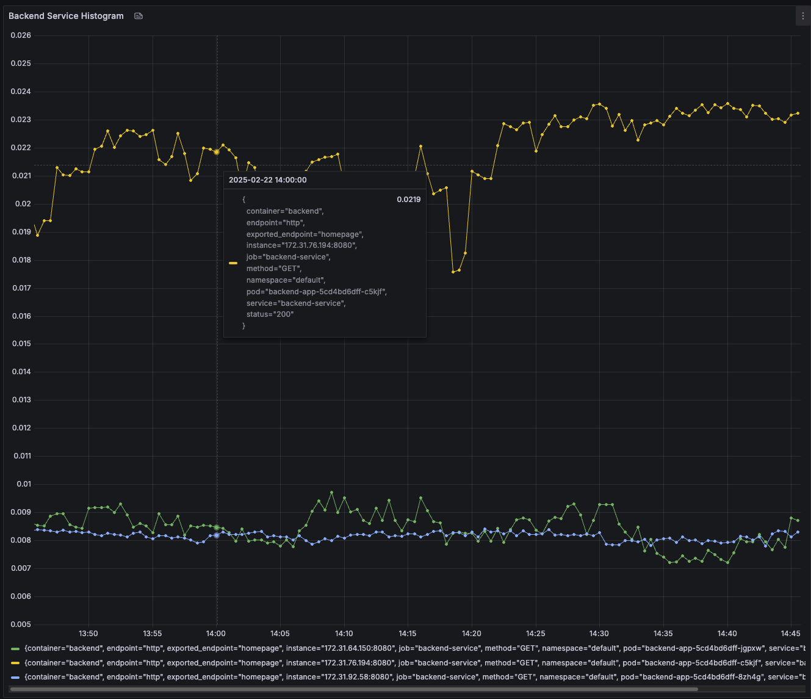

**Note:** For the screenshots, you can store all of your answer images in the `answer-img` directory.

## Verify the monitoring installation


## Setup the Jaeger and Prometheus source


*TODO:* Expose Grafana to the internet and then setup Prometheus as a data source. Provide a screenshot of the home page after logging into Grafana. - Captured

* Helm installed in virtual machine: 

* Preparing to install helm into /usr/local/bin 
* helm installed into /usr/local/bin/helm

NAME: prometheus
LAST DEPLOYED: Tue Mar 26 21:42:55 2024
NAMESPACE: monitoring
STATUS: deployed
REVISION: 1
NOTES:
kube-prometheus-stack has been installed. Check its status by running:
  kubectl --namespace monitoring get pods -l "release=prometheus"

Visit https://github.com/prometheus-operator/kube-prometheus for instructions on how to create & configure Alertmanager and Prometheus instances using the Operator.


## Create a Basic Dashboard


## Describe SLO/SLI
SLO is the goal that we want to achieve, and SLI is the metric that we use to measure the SLO. For example, if we have an SLO of 99.95% uptime per month, we can use the SLI of the number of requests that are successful in a month to measure the SLO. If we have an SLO of 200ms response time, we can use the SLI of the average response time of requests in a month to measure the SLO.

## Creating SLI metrics. 

### Monthly Uptime

* Availability Percentage: This metric represents the percentage of time your service was available within a given month. It's calculated by dividing the total uptime by the total time in the month.

* Downtime Duration: This metric measures the total duration of downtime experienced by your service in the month. It's important for understanding the impact of outages on your users.

* Number of Incidents: Count the number of incidents or outages that occurred during the month. This metric helps in understanding the frequency and severity of service disruptions.

* Mean Time Between Failures (MTBF): MTBF calculates the average time between failures or incidents. It provides an estimate of how frequently your service encounters issues.

* Mean Time to Recover (MTTR): MTTR measures the average time taken to restore service after an incident. It helps in assessing the efficiency of your incident response and recovery processes.

### Request Response Time

* Average Response Time: This metric calculates the average time taken to respond to requests over a period of time. It's a fundamental metric for assessing the performance of your service.

* Percentile Response Time: Analyze response times at different percentiles (e.g., 90th, 95th, and 99th percentiles). Percentile response times give you insights into the performance experienced by most users, including those in the tail end of the distribution.

* Peak Response Time: Identify the maximum response time experienced during peak usage periods. This metric helps in understanding worst-case scenarios and capacity planning.

* Response Time Distribution: Analyze the distribution of response times across different quantiles or time periods. It helps in identifying patterns, outliers, and areas for optimization.

* Time to First Byte (TTFB): TTFB measures the time taken from when a request is sent until the first byte of the response is received. It's a critical component of response time, especially for web services.

## Create a Dashboard to measure our SLIs
*TODO:* Create a dashboard to measure the uptime of the frontend and backend services We will also want to measure 40x and 50x errors. Create a dashboard that show these values over a 24-hour period and take a screenshot.

### Uptime for Frontend and Backend Services


### 40x and 50x Errors


The backend did not have any 40x or 50x errors in the last 24 hours.

## Tracing our Trial Flask App


## Jaeger in Dashboards


## Report Error
*TODO:* Using the template below, write a trouble ticket for the developers, to explain the errors that you are seeing (400, 500, latency) and to let them know the file that is causing the issue also include a screenshot of the tracer span to demonstrate how we can user a tracer to locate errors easily.

TROUBLE TICKET

Name: Hung Truong

Date: Feb 22, 2025

Subject: Jaeger Trace Reports Connection Error in trial-app

Affected Area: trial-app - External API Calls

Severity: High

Description:

Jaeger tracing for the trial-app service reports a connection error when attempting to fetch job data from https://jobs.github.com/positions.json?description=python. The error logs indicate that the request fails due to a connection refusal (Errno 111), leading to multiple retries before ultimately reaching the maximum retry limit.

Error Details:
*	Service: trial-app
*	Instance: trial-app-86c664d9c5-7m7pl
*	Hostname: jobs.github.com
*	Port: 443
*	Error Type: requests.exceptions.ConnectionError
*	Error Message:

```
HTTPSConnectionPool(host='jobs.github.com', port=443): Max retries exceeded with url: /positions.json?description=python 
(Caused by NewConnectionError('<urllib3.connection.HTTPSConnection object at 0x7f17abff70d0>: Failed to establish a new connection: [Errno 111] Connection refused'))
```

Stack trace:

```
File "/app/app.py", line 69, in trace
    res = requests.get("https://jobs.github.com/positions.json?description=python")
File "/usr/local/lib/python3.8/site-packages/requests/adapters.py", line 516, in send
    raise ConnectionError(e, request=request)
```

## Creating SLIs and SLOs

To ensure our application maintains a Service Level Objective (SLO) of 99.95% uptime per month, we need to define four Service Level Indicators (SLIs) that will measure our success.

###  Availability SLI
Percentage of successful HTTP responses (e.g., HTTP 200-299) over the total requests.

Why? Measures overall uptime and ensures the service is accessible to users.

### Request Latency SLI
Percentage of requests that complete within an acceptable threshold (e.g., 99% of requests under 200ms).

Why? Ensures that even when the application is up, it is still performing efficiently.

### Error Rate SLI

Metric: Percentage of failed requests (HTTP 500-599 or timeout errors) over total requests.

Why? Ensures that users are receiving correct responses and the service is not experiencing major failures.

### Request Throughput SLI

Metric: Number of requests successfully processed per second/minute (Requests Per Second - RPS).

Why? Ensures the system is capable of handling expected traffic loads without degradation.

## Building KPIs for our plan
### **KPIs to Measure Our SLIs and SLO (99.95% Uptime)**

Now that we have our **SLIs and SLOs**, we will define **Key Performance Indicators (KPIs)** to accurately track our **service reliability and performance**.

---

### KPI 1: Uptime Percentage
**Formula:**  
\[
\text{Uptime} = \left( 1 - \frac{\text{Total Downtime (mins)}}{\text{Total Time (mins)}} \right) \times 100
\]

**Why This KPI?**
- This KPI directly measures how well we are maintaining **99.95% uptime** per month.
- Helps in identifying unexpected downtime events and improving system availability.

---

### KPI 2: 95th Percentile Request Latency
**Formula:**  
\[
\text{95th Percentile Latency} = \text{Time taken for 95% of requests to complete (ms)}
\]

**Why This KPI?**
- Helps ensure that our **Latency SLI** meets the desired threshold.
- 95th percentile is a better indicator than average latency, as it highlights **outliers and performance spikes** that could degrade user experience.

---

### KPI 3: Error Rate (%)
**Formula:**  
\[
\text{Error Rate} = \frac{\text{Failed Requests (5xx)}}{\text{Total Requests}} \times 100
\]

**Why This KPI?**
- This KPI measures how often users experience **failed responses**.
- Ensures that we keep our **Error Rate SLI** within acceptable limits.

## Final Dashboard


### KPI Graphs for Frontend Service


2 indicators:

* up time: Threshold: Must be ≥ 99.95% for compliance (green line)
* Error rate: no data for 4xx and 5xx errors


**95th Percentile Request Latency of Frontend**


* histogram_quantile(0.95, ...) → Computes 95th percentile latency.
* rate(http_request_duration_seconds_bucket[5m]) → Measures response times over the last 5 minutes.
* Threshold: Requests should complete within 200ms.

### KPI Graphs for Backend Service


2 indicators:

* up time: Threshold: Must be ≥ 99.95% for compliance (green line)
* Error rate: no data for 4xx and 5xx errors

**95th Percentile Request Latency of Backend**




* histogram_quantile(0.95, ...) → Computes 95th percentile latency.
* rate(http_request_duration_seconds_bucket[5m]) → Measures response times over the last 5 minutes.
* Threshold: Requests should complete within 200ms.

# References

## To Access Jaeger UI
Run this command first in a terminal and leave it open for monitoring the access.
```bash
kubectl port-forward -n observability svc/jaeger-query 16686:16686
```
Then open a browser and go to `http://localhost:16686/` to access the Jaeger UI.

